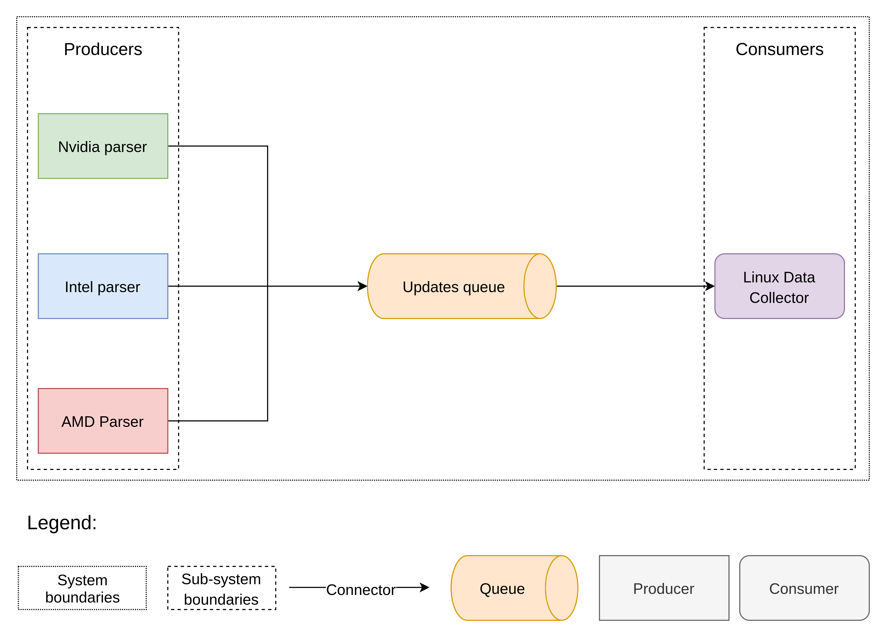

# Linux System Monitor


This repository contains library for getting statistics of gpu usage for Linux operating system. For now it supports nvidia, amd and intel graphics cards.

### Prerequisites

This is project build with [Maven](https://maven.apache.org/).

You can download and install Maven from [here](https://maven.apache.org/download.cgi)
or use default package manager of your system.

Also, in the process of getting gpu statistics, this library uses default gpu monitors for each type of gpu. If you did not have default monitors please install them:

+ `nvidia-smi` for Nvidia;
+ `radeon-top` for AMD;
+ `intel_gpu_top` for Intel;

## Build

To build this project simply run

```
mvn compile
```

This will fetch all dependencies, compile the project and generate one additional 
folder (`target`) in the root of the project.

## Run

To run this project, you can create `.jar` file and execute it:

``` 
mvn package
java -jar target/<FILE_NAME>.jar
```

*NOTE*: Statistics for AMD and Intel graphics can be gathered only with root access to the system. Therefore, if you need statistics for AMD and Intel you should run apllication with a `sudo`.

## Test

To run tests simply type:

``` 
mvn test
```

## Project structure

On the following diagram you can observe the structure of this library:



Project relies on producer-consumer kind of architecture. 

On the left side of this diagram you can examine different consumers for each type of gpu. They are pushing updates with predefined frequency into the queue. 

We are using bounded blocking queue to prevent memory leaks and diffent "null" exceptions. Also, with this type of queue we does not care about pulling frequency of consumer. 

On the right side of this diagram you can see the consumer. For now, we implemented simple consumer which prints updates into the console, but this consumer can be easily replaced by Innomectics Data Collector. In this case Data Collector should start producers in different threads (one thread per producer), pass queue to them and then pull updates from it.

## File Structure

Here you can examine file structure of the project:

```
.
├── docs
├── pom.xml
├── README.md
├── src
│   ├── main
│   │   └── java
│   │       ├── Consumer.java
│   │       ├── Gpu
│   │       │   ├── Gpu.java
│   │       │   ├── Memory.java
│   │       │   ├── ProcessInfo.java
│   │       │   └── Utilization.java
│   │       ├── GpuType.java
│   │       ├── GpuTypes
│   │       │   ├── AMD.java
│   │       │   ├── Intel.java
│   │       │   ├── Nvidia
│   │       │   │   ├── NvidiaGpu.java
│   │       │   │   ├── NvidiaMemory.java
│   │       │   │   ├── NvidiaProcessInfo.java
│   │       │   │   └── NvidiaUtilization.java
│   │       │   └── Nvidia.java
│   │       ├── Intel_GPU_monitor.java
│   │       ├── Main.java
│   │       └── Runner.java
│   └── test
└── test_samples
```

+ The main folder is `src/main/java`. It contains whole implementation. 

+ In the directory `src/main/java/GpuTypes` placed implementation for each producer.

+ In the `src/main/java/Gpu` folder you can examile classes which stores gpu statistics.

+ In the file `src/main/java/Runner.java` you can see example of running multiple consumers and one consumer.

+ `src/main/java/Consumer.java` is an example of *Consumer*.

+ `src/test` folder contains tests code.

+ `test_samples` folder constains samples for tests.

+ `docs` folder contatins assest for the documentation which you are reading now.
